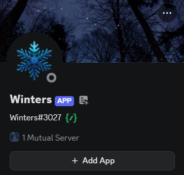

<div align="center">
    
</div>

<br>

<p align="center">
    <a href="https://www.python.org/downloads/release/python-3142/"></a>
    <a href=""></a>
    <a href=""></a>
    <a href="https://github.com/DevEooo/Discord-Chatbot/commits/main/"></a>
</p>

--- 

## About

**Winter** is an Integrated Python Discord chatbot for answering questions and analyzing supported files in a Discord server. It uses `discord.py` for Discord events and commands, Google Gemini as its core and `prompt.txt` as a fixed system instruction that defines the bot's identity & behavior.

## Methods and Approach to Build This App

1. **Event-driven Discord client:** `discord.py` listens for messages and registers the slash command during startup.
2. **Input filtering:** The mention handler removes the bot mention, escapes user mentions, checks cooldowns, and validates attachment MIME types, extensions, and size.
3. **Context construction:** When a user replies to the bot, the handler adds the previous message and one earlier message as conversation context.
4. **Multimodal Gemini request:** Text and validated image/PDF bytes are passed to `google.genai`, together with the fixed instruction loaded from `prompt.txt`.
5. **Discord response handling:** Manipulating LLM response by splitting into chunks, so it can be sent within Discord message limits.
6. **Failure handling:** Missing credentials or an invalid prompt stop startup with a clear error. Runtime API and attachment failures return a user-safe fallback message and are logged.
7. **Bug reporting workflow:** `/bug_report` opens a modal and forwards the submitted details and optional attachment to the developer channel. Used for collecting users feedback for further development.
<br>

> [!Note]
> This project costs `$0`. **API usage** and **hosting** are the two **possible recurring costs**. Therefore, cooldowns and attachment limit are useful to control API consumption, but they do not guarantee a zero bill.

## Key Features

- Responds when a user mentions the bot or replies to one of its messages.
- Includes recent reply context when continuing a conversation.
- Sends questions and supported images or PDFs to Gemini for analysis.
- Accepts PNG, JPG, JPEG, WEBP, GIF, and PDF attachments up to 5 MB.
- Splits long Gemini responses into Discord-sized message chunks.
- Provides a `/bug_report` command with a modal for title, description, and an optional attachment.
- Applies cooldowns to reduce spam and unnecessary API requests: 10 seconds per user, 5 seconds per channel, and 60 seconds for bug reports.
- Escapes user mentions before sending generated content back to Discord.

## Command & Bot Usage

- Mention it along with the question, for example: `@Winter` Analyze this pdf file.
- Reply to one of the bot's messages to continue the conversation.
- Attach an image or PDF to a mention for analysis. Unsupported files and files over 5 MB are ignored.
- Use `/bug_report` to open the bug-report form. The report is forwarded to the configured `id_channel`.

## Prerequisites and Cost

### Technical prerequisites

- Python 3.10.0+ (this project was developed with Python 3.14.2).
- A Discord account and a Discord application/bot created in the [Discord Developer Portal](https://discord.com/developers/applications).
- A Google AI Studio account and Gemini API key. (Or any LLM API works as well with minor changes)
- A Discord server (or any server) where you able to invite the bot and enable the required message-content intent.

## Installation

1. Clone this repository
Copy this command into your terminal
   ```bash
    git clone https://github.com/DevEooo/Discord-Chatbot.git
    ```
<br>

2. Install prerequisite dependencies
To run this app, we need to install some libraries such as: discord.py, google.genai (or any LLM models you preferred) and python-dotenv.
   ```bash
   pip install discord.py google.genai python-dotenv
   ```
<br>

3. Setup your .env and prompt.txt files
Create .env in project's root containing discord and LLM credential (more on .env_example) and prompt.txt in root as well. You could customize your own chatbot prompt creatively, or modify the chatbot template that I've written in prompt_example.txt!

<br>

4. All set!
Your discord chatbot is ready to use! Run this app file by inserting this command:
    ```bash
    python main.py
    ```


    
